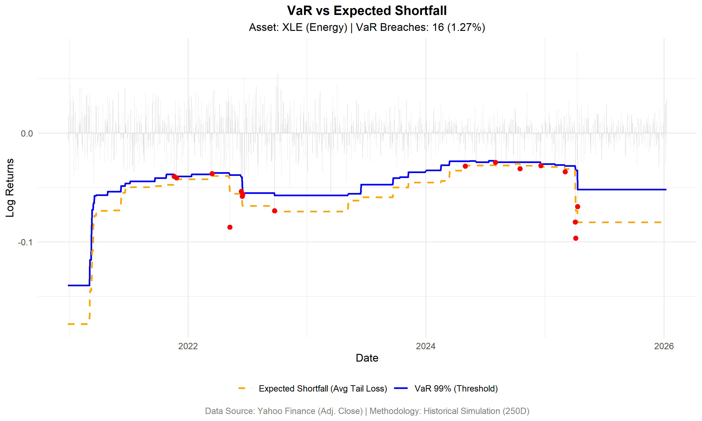

# Quantitative Market Risk Framework

## Overview
This repository hosts a quantitative framework for **Market Risk Management** and **Model Validation**, developed in **R**. 
The objective is to calculate regulatory risk metrics (Value at Risk) and perform independent validation (Backtesting) to assess model performance under stress.

 **Asset Universe:** Energy Select Sector SPDR Fund (**XLE**) – serving as a proxy for commodity exposure and energy equity risk.

**Data Ingestion:** Automated data extraction from Yahoo Finance using `quantmod`.
## Methodology
We implemented a **Historical Simulation** approach (Full Valuation), which is non-parametric and makes no assumptions about the normality of return distributions.

* **Value at Risk (VaR 99%):** The quantile of the loss distribution such that:
    $$P(L > VaR) = 1 - \alpha$$
    *(Where $\alpha = 0.99$. We look back 250 trading days).*
    
* **Expected Shortfall (ES 99%):** The conditional expectation of loss given that the loss exceeds VaR (Tail Risk):
    $$ES_{\alpha} = E[L | L > VaR_{\alpha}]$$
    *(This captures the "severity" of tail events, compliant with Basel III / FRTB standards).*
* **Model Validation (Backtesting):**
    * Detection of **Breaches** (Exceptions) where actual loss exceeds VaR.
    * Visual inspection of model performance over time.

## Insights & Backtesting Results
The chart below illustrates the model's performance over the 2020-2025 period, capturing the post-COVID recovery and the 2022 Energy Crisis.
* **Blue Line:** Value at Risk (99% Threshold).
* **Orange Line:** Expected Shortfall (Average loss when things go wrong).
* **Red Dots:** Actual market crashes that broke the model limit.

**Observations**: 
1. **Volatility Clustering (Heteroskedasticity):** The graph clearly shows that breaches are not randomly distributed but clustered during stress periods (e.g., 2020 and 2022). This confirms that financial returns exhibit *volatility clustering*—large changes tend to be followed by large changes.
2. **Fat Tails (Leptokurtosis):**
    The significant gap between the **Blue Line (VaR)** and the **Orange Line (ES)** during high volatility indicates a "Fat-Tailed" distribution. The standard Normal distribution would underestimate these extreme losses. The ES metric proves crucial here, providing a buffer that VaR misses.

3.  **Model Performance:**
    * **Breach Count:** 16 breaches over the sample period.
    * **Breach Rate:** **1.27%**, which is slightly higher than the theoretical 1.00% target.
    * **Conclusion:** The Historical Simulation is robust but slightly slow to react to sudden regime changes (Ghost Effect). A volatility-weighted approach (e.g., EWMA or GARCH) could improve responsiveness.

## Technologies
* **Language:** R (v4.0+)
* **Libraries:** `quantmod`, `PerformanceAnalytics`, `ggplot2`, `dplyr`.

---
*Author: Alessandro D'Atria | Risk Management Professional*
